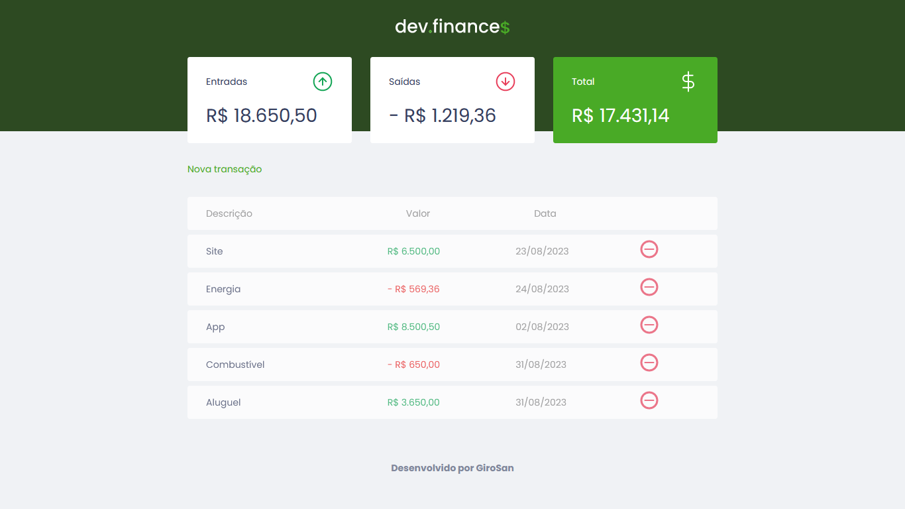

<h1>Projeto MAIIK BRITO - DEV Finance$</h1>
 

Projeto realizado seguindo tutorial do You Tube do canal do Maik Brito, instrutor da RoccketSeat. 

 
<h2>Layout Desktop</h2>
 

 
<h2>Layout Desktop Modal</h2>
 

 
<h2>Layout Desktop Adicionando Fields</h2>
 

 
<h2>Layout Desktop Erro de Preenchimento</h2>
 

 
<h2>Layout Mobile</h2>
 

 
<h2>Layout Mobile Modal</h2>
 

 

<h3>Sobre o exercício</h3>
 

Este foi um exercício longo. Três videos que cada um continha em média duas horas e meia , três horas. Deu pra praticar bastante. 
Confesso que preciso revisar mais e mais vezes esse exercício porque teve muita coisa que eu não conhecia, porém passei a conhecer. Gostei do desafio. A lógica fiz acompanhando o instrutor. Mas consegui entender muita coisa.
